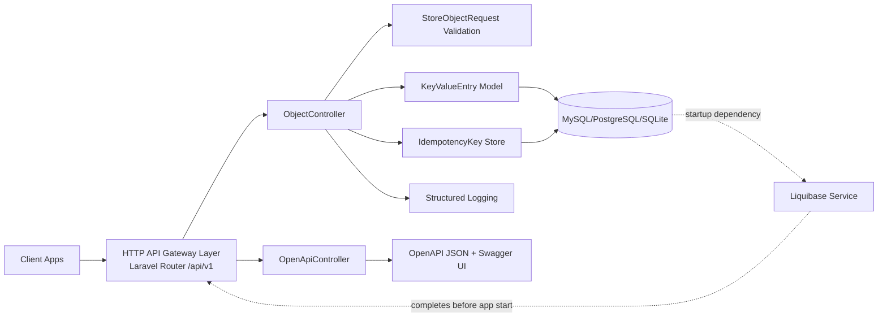
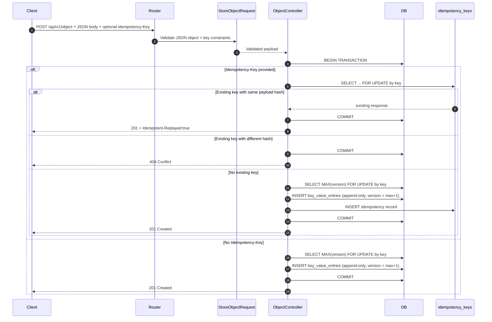
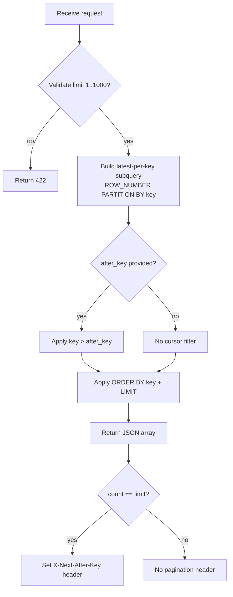
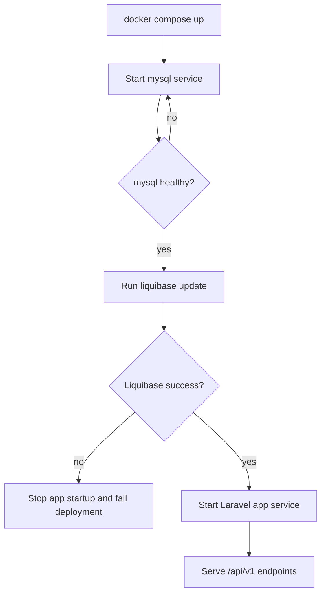
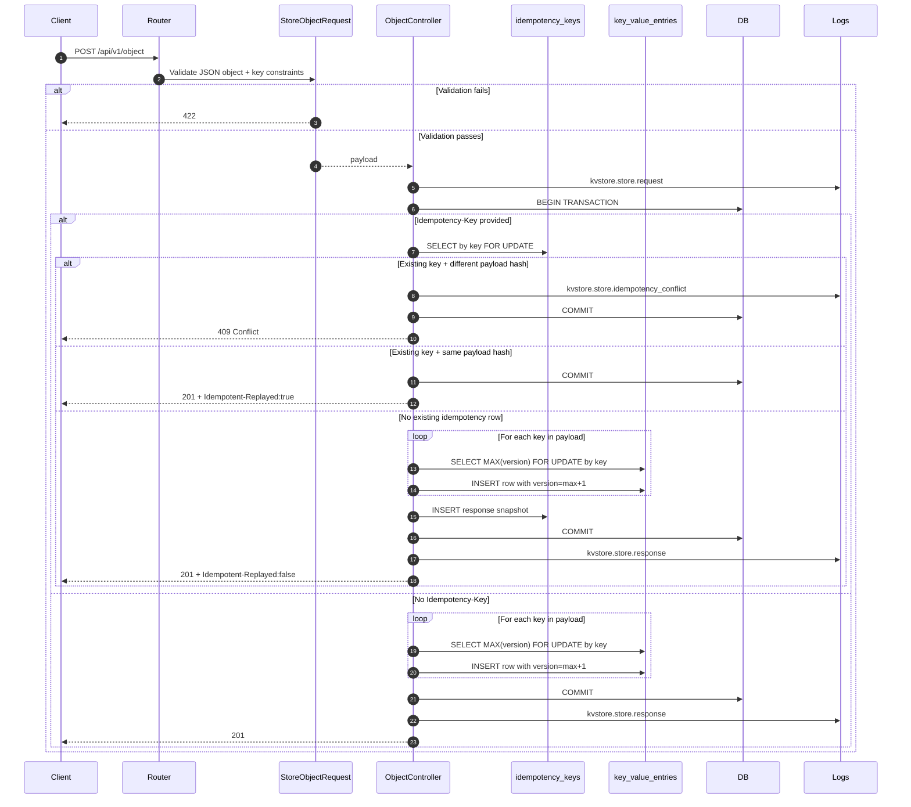
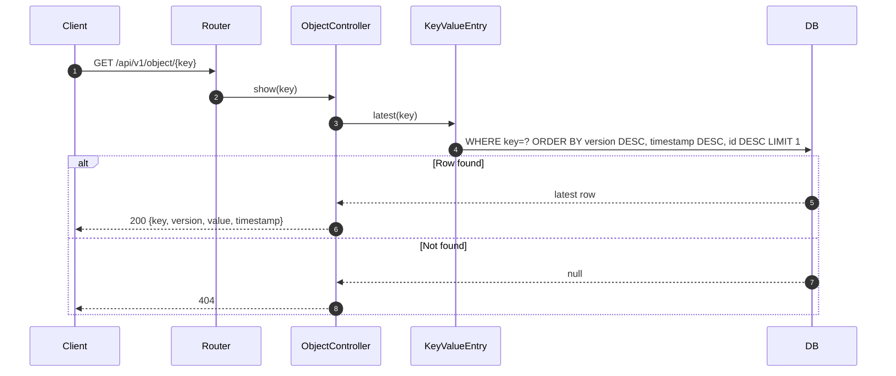
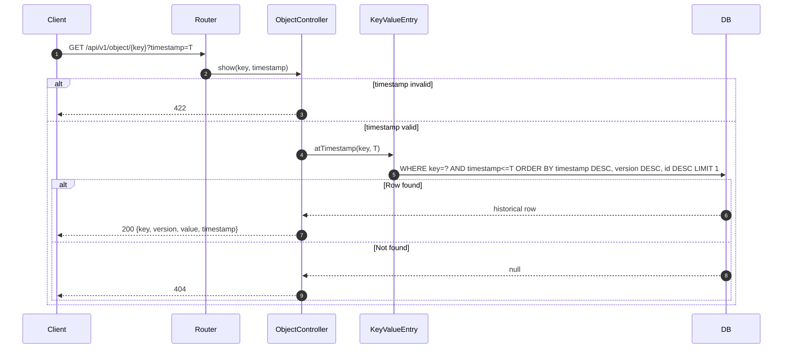
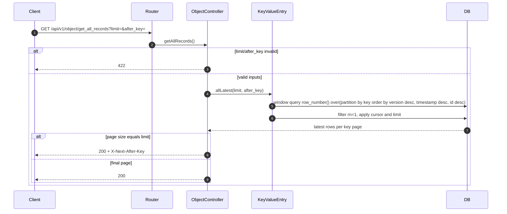

# Project Architecture

## Scope

This document captures architecture decisions, HLD, and LLD for the Secretlab version-controlled key-value API.

## Key Decisions

- API is versioned with context path `/api/v1`.
- Write model is append-only for immutable history.
- Each update increments a monotonic `version` per key.
- Multi-key POST writes are atomic using DB transactions.
- Optional idempotency support is implemented with `Idempotency-Key`.
- Time-travel reads use floor lookup (`timestamp <= requested`) with deterministic tie-break (`version DESC`, then `id DESC`).
- `get_all_records` uses keyset pagination (`limit`, `after_key`) for scalability.
- Composite index `(key, timestamp, version)` is the primary query index; redundant single-column key index is removed.
- Structured logs are emitted for store request/response and idempotency conflicts.
- Docker startup runs Liquibase migrations before app boot (MySQL health-gated).

## HLD

## LLD: POST /api/v1/object

## LLD: GET /api/v1/object/get_all_records

## Data Model

### key_value_entries

- `id` bigint PK
- `key` varchar(255)
- `version` unsigned bigint (monotonic per key)
- `value` json
- `timestamp` unsigned bigint (UTC UNIX seconds)
- `created_at`, `updated_at`
- Index: `(key, timestamp, version)`

### idempotency_keys

- `id` bigint PK
- `key` varchar(255) UNIQUE
- `request_hash` char(64)
- `status_code` unsigned smallint
- `response_body` json
- `created_at`, `updated_at`
- Index: `created_at`

### liquibase metadata tables (managed by Liquibase)

- `DATABASECHANGELOG`
- `DATABASECHANGELOGLOCK`

## Non-Functional Alignment

- Thread safety: transactional writes + row-level lock (`SELECT ... FOR UPDATE`) on idempotency key.
- Logging: request-level and idempotency conflict logs with correlation ids.
- Scalability: keyset pagination and bounded page size.
- Idempotency: safe retriable writes when clients provide idempotency keys.
- Reliability: comprehensive feature/unit tests with high coverage.

## Startup Migration Orchestration (Docker)

## Runtime Flows

### Flow A: Insert or Update via POST /api/v1/object

Notes:

- "Insert" means first write for a key (version starts at 1).
- "Update" means write same key again (version increments by 1).
- Both paths use the same endpoint and same transaction flow.

### Flow B: Get Latest via GET /api/v1/object/{key}

### Flow C: Time-Travel via GET /api/v1/object/{key}?timestamp=T

### Flow D: Get Latest for All Keys via GET /api/v1/object/get_all_records

